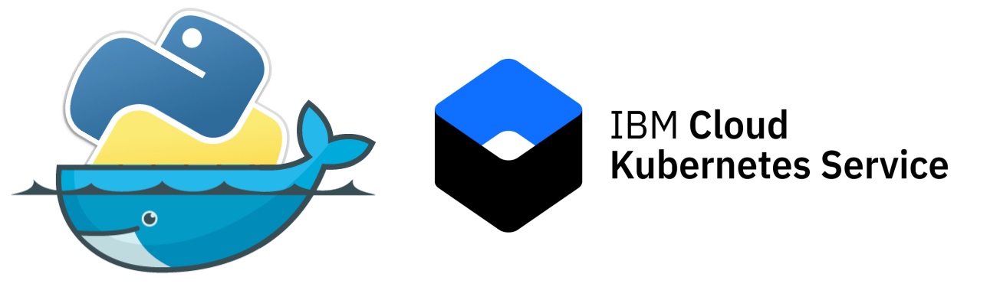

> 2014 - We must adopt microservices to solve all problems with monoliths.

> 2016 - We must adopt docker to solve all problems with microservices.

> 2018 - We must adopt kubernetes to solve all problems with docker.

Kubernetes has been out there for quite sometime and people are hearing about its greater capabilities, but a lot of them haven't started using it yet. If you are one of them, you are late to the party, but that's ok; better late than never. A few developers I spoke with say that there is no proper guide available (we can find a lot of good articles spread across multiple websites rather than in a single place) or they fear starting something new. In this how-to, I cover step by step instructions on building a containerized Flask application using Docker and deploying it to IBM Cloud Kubernetes Service.

## Learning objectives
After completing this how-to, the reader will be able to:

* Containerize a flask application using docker and deploy it to IBM cloud Kubernetes Service.

## Prerequisites

* IBM Cloud account - [sign up](https://console.bluemix.net/registration/) if you don't have an account yet.

* [Install the IBM Cloud CLI](https://console.bluemix.net/docs/cli/reference/bluemix_cli/get_started.html#getting-started)

* [Install the Docker CLI](https://docs.docker.com/install/)

* [Kubernetes CLI](https://kubernetes.io/docs/tasks/tools/install-kubectl/)

## Estimated time

It should take around 45 minutes to complete this how-to.

## Steps

### Create A Kubernetes Cluster

* Go to your **IBM Cloud Dashboard** and [Sign in](https://console.bluemix.net/dashboard/apps/)
* Go to **IBM Kubernetes Service**

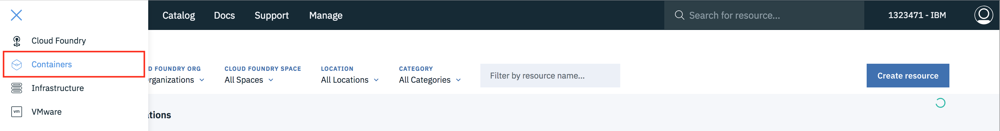

* Click on **Create Cluster**

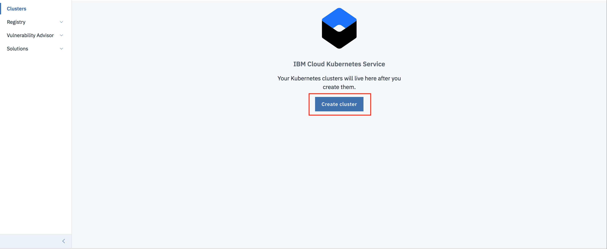

* Select the **region** where you want to deploy the cluster, give a **name** to your cluster and click on **create cluster**.
* Depending upon your account (**Paid or Free**), select the appropriate cluster type.
* It takes some time for cluster to get ready (around 30 mins).

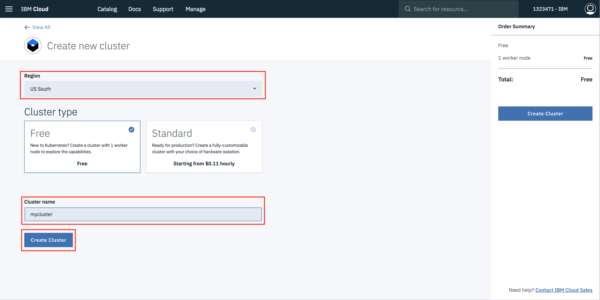

* Once the cluster is ready, click on your cluster name and you will be redirected to a new page containing information regarding your cluster and worker node.

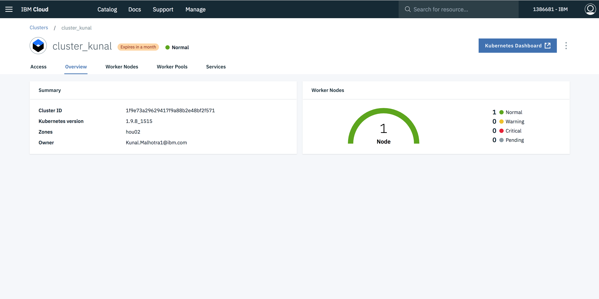

* Click on worker node tab, to get cluster's **Public IP**.

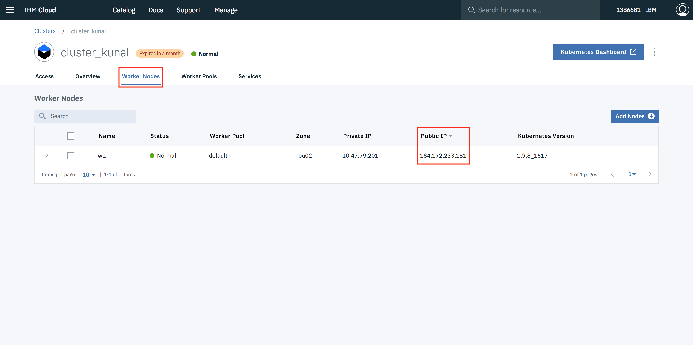

### Containerizing Flask Application

* In your project directory create a file with name **Dockerfile**. Note:- File name should be exactly Dockerfile, nothing else.

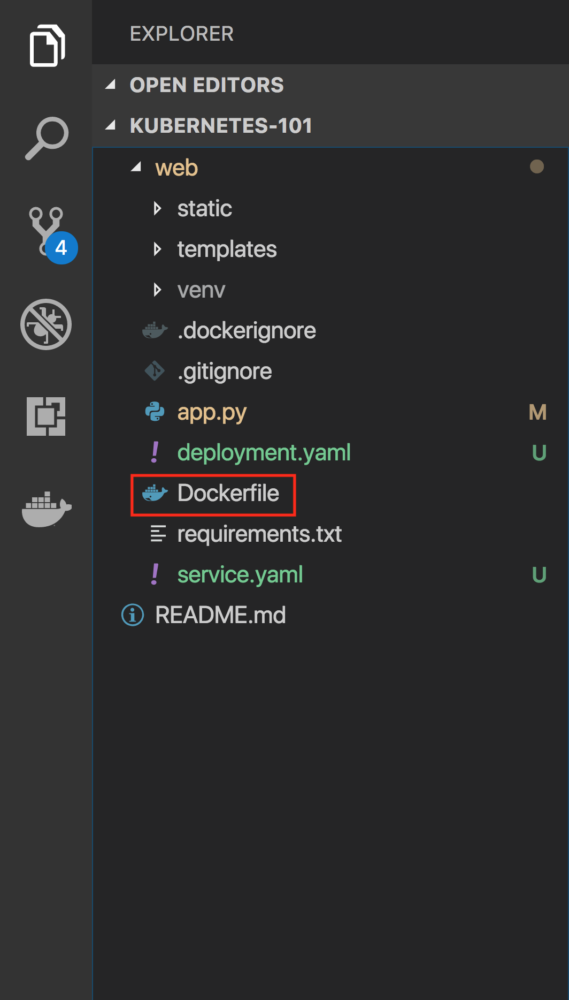

> A Dockerfile is a text document used to indicate to Docker a base image, the Docker settings you need, and a list of commands you would like to have executed to prepare and start your new container.

* In the file, paste this code.

```
FROM python:2.7-onbuild
LABEL maintainer="Kunal Malhotra, kunal.malhotra1@ibm.com"
RUN apt-get update
RUN mkdir /app
WORKDIR /app
COPY . /app
RUN pip install -r requirements.txt
EXPOSE 5000
ENTRYPOINT [ "python" ]
CMD [ "app.py" ]
```

### Explaination of above code.

```
FROM python:2.7-onbuild
```

Because this Flask Application uses Python 2.7, we want an environment that supports it and already has it installed. Fortunately, DockerHub has an official image that’s installed on top of Ubuntu. In one line, we will have a base Ubuntu image with Python 2.7, virtualenv, and pip. There are tons of images on DockerHub, but if you would like to start off with a fresh Ubuntu image and build on top of it, you could do that.

```
LABEL maintainer="Kunal Malhotra, kunal.malhotra1@ibm.com"
RUN apt-get update
```

Note the maintainer and update the Ubuntu package index. The command used is RUN, which is a function that runs the command after it.

```
RUN mkdir /app
WORKDIR /app
COPY . /app
```

Now it’s time to add the Flask application to the image. For simplicity, copy the application under the /app directory on our Docker Image.

**WORKDIR** is essentially a **cd** in bash, and **COPY** copies a certain directory to the provided directory in an image. **ADD** is another command that does the same thing as COPY, but it also allows you to add a repository from a URL. Thus, if you want to clone your git repository instead of copying it from your local repository (for staging and production purposes), you can use that. COPY, however, should be used most of the time unless you have a URL.

```
RUN pip install --no-cache-dir -r requirements.txt
```
* Now that we have our repository copied to the image, we will install all of our dependencies, which is defined in requirements.txt

```
EXPOSE 5000
```
* Expose the port(5000) the Flask application runs on.

```
ENTRYPOINT [ "python" ]
CMD [ "app.py" ]
```
* Specifiy the entrypoint of you application.

### Build image from Dockerfile.

* Open terminal and type this command to build an image from your dockerfile.

```
docker build -t <image_name>:<tag> .
```
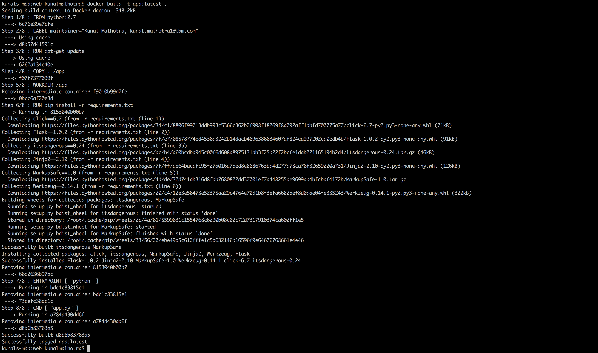

### Run Container Locally And Test.

* After image build is successfull, type

```
docker run -d -p 5000:5000 app
```
* The command will create a container containing all the application code and dependices from the image and run it locally.

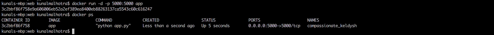

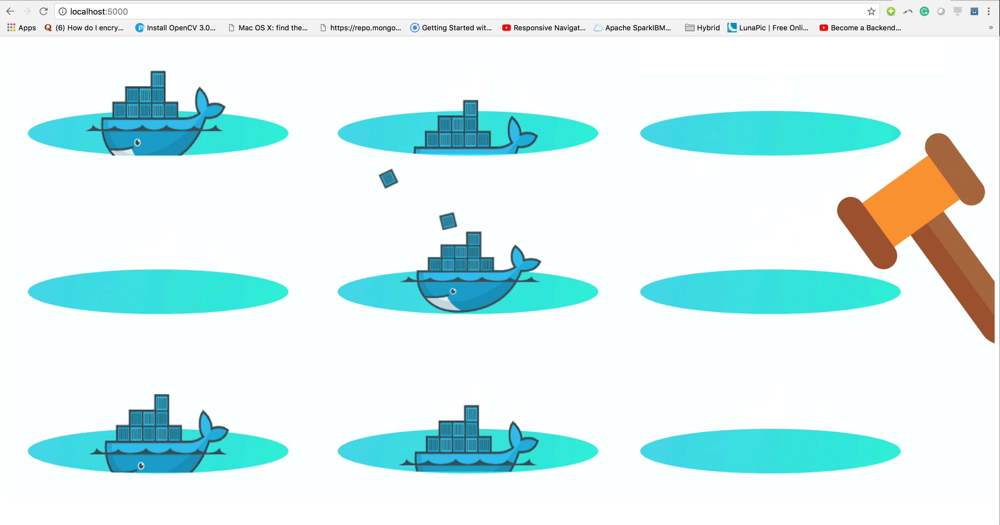

### Pushing the image to IBM Cloud Registry

* From you account dashboard, go to **IBM Kubernetes Service**.
* From the left navigation drawer select **Private Repositories**.

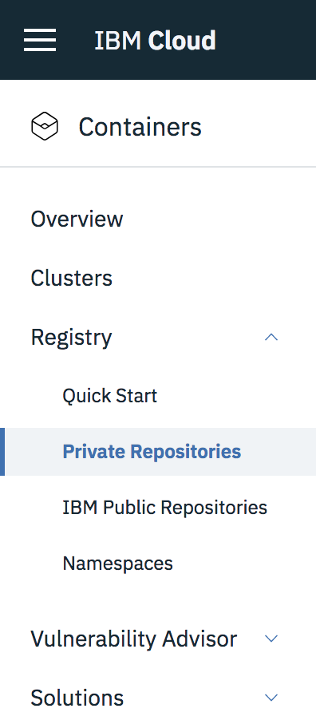

1. Install the Container Registry plug-in.

```
ibmcloud plugin install container-registry -r Bluemix
```
2. Log in to your IBM Cloud account.

```
ibmcloud login -a <cloud_foundary_end_point_for_the_region>
```

3. Choose a name for your first namespace, and create that namespace. Use this namespace for the rest of the Quick Start.

```
ibmcloud cr namespace-add <namespace>
```
4. Log your local Docker daemon into the IBM Cloud Container Registry.

```
ibmcloud cr login
```
5. Choose a repository and tag by which you can identify the image.

```
docker tag <image_name> <region_url>/<namespace>/<image_name>:<tag>
```
6. Push the image.

```
docker push <region_url>/<namespace>/<image_name>:<tag>
```
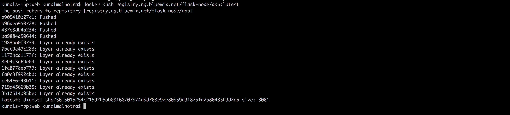

7. Verify that your image is in your private registry.

```
ibmcloud cr image-list
```
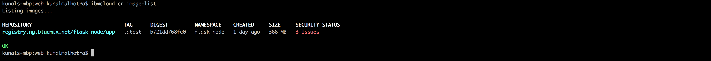

### Creating Configuration Files For Kubernetes

* Once the image is successfully uploaded to private registry, go to your project directory and create two files
1. deployment.yaml
2. service.yaml

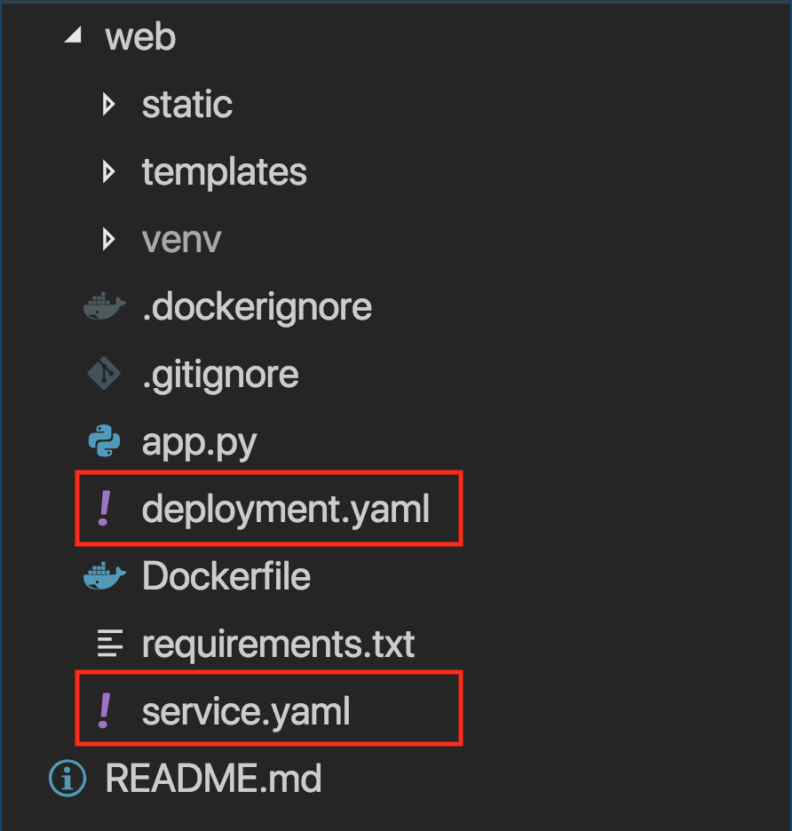

* In the deployment.yaml past this code.

```
apiVersion: extensions/v1beta1
kind: Deployment
metadata:
  name: flask-node-deployment
spec:
  replicas: 1
  template:
    metadata:
      labels:
        app: flasknode
    spec:
      containers:
      - name: flasknode
        image: registry.ng.bluemix.net/flask-node/app
        imagePullPolicy: Always
        ports:
        - containerPort: 5000

```
### Explaination of above code.

1. A Deployment named **flask-node-deployment** is created, indicated by the .metadata.name field.
2. The Deployment creates one replicated Pods, indicated by the replicas field.
3. The selector field defines how the Deployment finds which Pods to manage. In this case, we simply select on one label defined in the Pod template (app: flasknode). However, more sophisticated selection rules are possible, as long as the Pod template itself satisfies the rule.
4. The Pod template’s specification, or .template.spec field, indicates that the Pods run one container, flasknode, which runs the app private registry image.
5. The Deployment opens port 5000 for use by the Pods.

* After deployment.yaml is done, open **service.yaml** file and past this code.

```
apiVersion: v1
kind: Service
metadata:
  name: flask-node-deployment
spec:
  type: NodePort
  ports:
  - port: 5000
    targetPort: 5000
    nodePort: 30092
  selector:
    app: flasknode
```
### Explaination of above code.

* This specification will create a new Service object named “flask-node-deployment” which targets TCP port 5000 on any Pod with the "app=flasknode" label. This Service will also be assigned an IP address (sometimes called the “cluster IP”), which is used by the service proxies (see below). The Service’s selector will be evaluated continuously and the results will be POSTed to an Endpoints object also named “flask-node-deployment”.

* Note that a Service can map an incoming port to any targetPort. By default the targetPort will be set to the same value as the port field. Perhaps more interesting is that targetPort can be a string, referring to the name of a port in the backend Pods. The actual port number assigned to that name can be different in each backend Pod. This offers a lot of flexibility for deploying and evolving your Services. For example, you can change the port number that pods expose in the next version of your backend software, without breaking clients.

## Deploying Application To Kubernetes

1. Target the IBM Cloud Container Service region in which you want to work.

```
ibmcloud cs region-set us-south
```

2. Set the context for the cluster in your CLI.

    a. Get the command to set the environment variable and download the Kubernetes configuration files.

    ```
    ibmcloud cs cluster-config cluster_kunal
    ```
    b. Set the KUBECONFIG environment variable. Copy the output from the previous command and paste it in your terminal. The command output should look similar to the following.

    > export KUBECONFIG=/Users/$USER/.bluemix/plugins/container-service/clusters/< cluster_name >/< cluster_configuration_file.yaml>

3. Verify that you can connect to your cluster by listing your worker nodes.

```
kubectl get nodes
```

4. Create deployment

```
kubectl create -f deployment.yaml
```
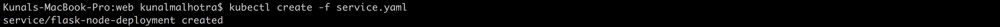

5. Create service

```
kubectl create -f service.yaml
```
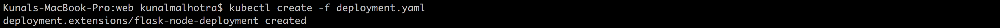

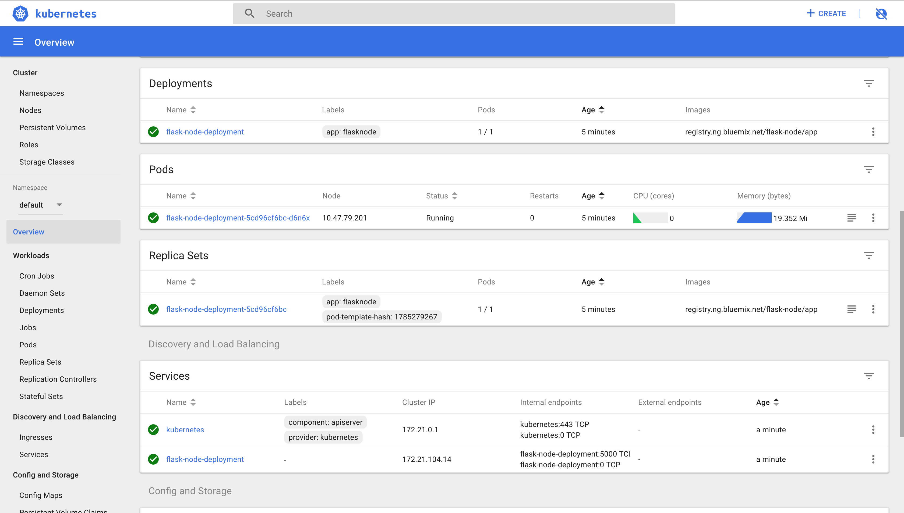

6. Final Step, go to your brower and ping the public ip of worker node.

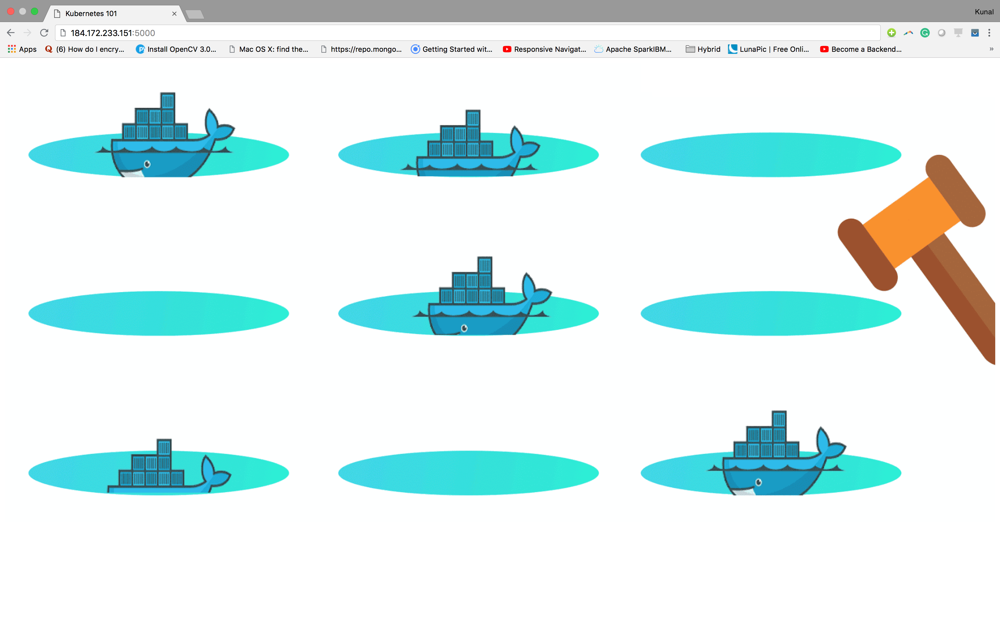

## Resources and References

1. [Kubernetes Documentation](https://kubernetes.io/docs/home/?path=users&persona=app-developer&level=foundational)
2. [A fast and easy Docker tutorial for beginners (video series)](https://medium.freecodecamp.org/docker-quick-start-video-tutorials-1dfc575522a0)
3. [Deploy a microservices app on IBM Cloud by using Kubernetes](https://www.ibm.com/cloud/garage/tutorials/microservices-app-on-kubernetes/)
4. [Tutorial: Deploying apps into clusters](https://console.bluemix.net/docs/containers/cs_tutorials_apps.html#cs_apps_tutorial)


